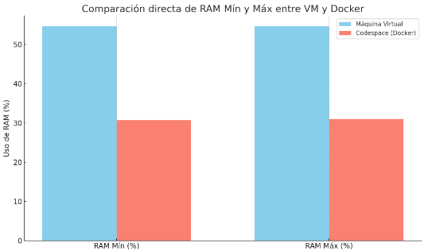
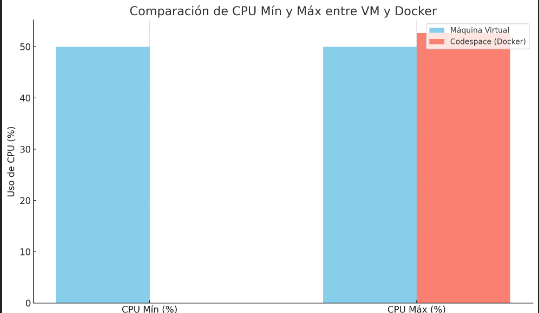
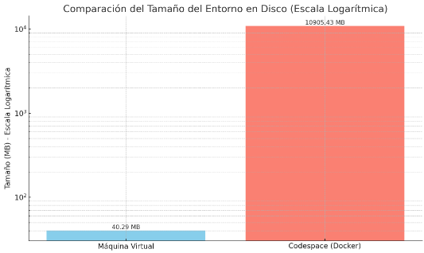
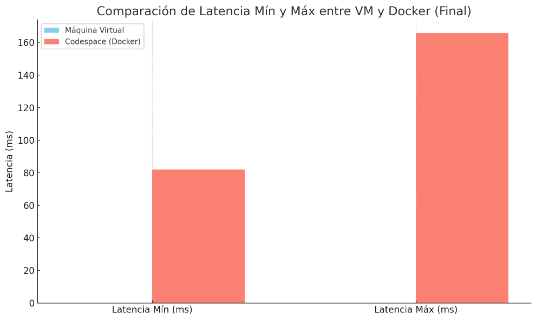

# 🍇 Proyecto de Benchmark: VM vs Docker con un Juego de Memoria🍌

Este proyecto evalúa y compara el rendimiento entre una máquina virtual (VirtualBox) y un contenedor Docker ejecutando un Juego de Memoria, también conocido como Memorama, con una interfaz web interactiva.

---

## 🖥️ ¿Qué son las máquinas virtuales y los contenedores? 🚢

Para comprender las diferencias entre los entornos en los que se puede ejecutar el Juego de Memoria, es importante entender qué son las máquinas virtuales (VM) y los contenedores. Estas dos tecnologías se utilizan ampliamente para aislar aplicaciones y simplificar su despliegue.

---

## 🌐 Máquinas Virtuales vs Contenedores Docker

En el mundo del desarrollo y la infraestructura moderna, **las máquinas virtuales (VMs)** y **los contenedores Docker** son dos tecnologías clave para la virtualización y despliegue de aplicaciones. Aunque ambas permiten ejecutar aplicaciones en entornos aislados, lo hacen de maneras muy diferentes.

---

## 🖥️ ¿Qué es una Máquina Virtual?

Una **Máquina Virtual** es una emulación completa de un sistema físico, que corre sobre un **hipervisor** como VirtualBox, VMware o Hyper-V.

### 🧱 Características:
- Ejecuta un **sistema operativo completo** (Linux, Windows, etc.).
- Tiene su propio **kernel**, sistema de archivos y recursos virtualizados.
- Más pesada en recursos y tiempo de arranque.

### 🪪 Ejemplo:
Una VM puede tener Ubuntu instalado, con un entorno de escritorio completo y aplicaciones, todo corriendo dentro de Windows.

> 🧠 Ideal cuando necesitas simular múltiples sistemas operativos o ejecutar software específico en un entorno totalmente aislado.

---

## 📦 ¿Qué es un Contenedor Docker?

Un **contenedor Docker** es una unidad ligera y portátil que empaqueta una aplicación con todas sus dependencias, usando el mismo kernel del sistema operativo host.

### ⚙️ Características:
- Comparte el **kernel del sistema host**, lo que los hace mucho más ligeros.
- Se ejecutan en segundos.
- Ideales para el desarrollo ágil y despliegue en la nube.

### 🐳 Ejemplo:
Puedes correr una aplicación en Python, con todas sus librerías y configuración, dentro de un contenedor que pesa solo unos megas.

> 🚀 Perfecto para microservicios, integración continua y despliegues rápidos.

---

## ⚔️ Comparativa Rápida

| Característica       | Máquina Virtual               | Contenedor Docker            |
|----------------------|-------------------------------|------------------------------|
| Sistema operativo    | Completo                      | Compartido (mismo kernel)    |
| Tiempo de arranque   | Lento (minutos)               | Rápido (segundos)            |
| Peso                 | Pesado (GBs)                  | Ligero (MBs)                 |
| Aislamiento          | Muy alto                      | Medio-alto                   |
| Casos de uso         | Emulación, entornos completos | Microservicios, CI/CD        |

---

## 🎯 Relación con el proyecto

En este proyecto se analiza el rendimiento y consumo de recursos de un Juego de Memoria ejecutándose en dos entornos distintos: una máquina virtual y un contenedor Docker. Esto permite evaluar cuál de las dos opciones resulta más eficiente y apropiada para aplicaciones web simples, además de comprender cómo cada tecnología influye en el rendimiento y la experiencia del usuario.

---

## ⚙️ Entorno de Pruebas

- **Host:** 12th Gen Intel(R) Core(TM) i7-1255U, 16 GB RAM, Windows 11  
- **Virtual Machine (Guest):** Ubuntu 20.04, 6 GB RAM, 2 vCPU, VirtualBox 7  
- **Docker:** Imagen base `python:3.10-slim`, 2 CPUs asignadas  
- **Red y conexión:** Ambas plataformas usan red NAT para conectarse al host.  

---

## 📁 Estructura actual del proyecto

    ├── README.md
    ├── enunciadoProyecto.md
    └── vm_vs_docker_benchmark/
        ├── install.ipynb
        └── vm_vs_docker_benchmark/
            ├── JuegoDeMemoria/
            │   ├── codigo.html
            │   ├── ConstructorDeImagen Docker
            │   ├── Dockerfile
            │   ├── EjecutadorDeCodigo Docker
            │   └── metricas.html
            ├── notebooks/
            │   └── vm_vs_docker_comparision.ipynb
            ├── results/
            │   ├── Metricas Docker.png
            │   ├── Metricas VM.png
            │   └── README.md
            ├── scripts/
            │   ├── docker_setup.sh
            │   ├── Dockerfile
            │   ├── JuegoDeMemoria.py
            │   ├── metricas.py
            │   └── vm_setup.sh
            ├── .gitignore
            └── README.md

---

## Requisitos

- **Python 3.8+** – Lenguaje base del proyecto.
- **Docker** – Para ejecutar el proyecto en contenedores y comparar el rendimiento.
- **VirtualBox** – Máquina virtual.
- **Git/GitHub** – Control de versiones y almacenamiento del código fuente.
- **Navegador web** – Para usar la interfaz de carga de imágenes.
- **Editor de código** *(Visual Studio Code, PyCharm, etc.)* – Para desarrollo y pruebas.
---

## 📚 Recursos Utilizados

### 🛠️ Herramientas y Plataformas

- **Python 3.8+**: Lenguaje de programación principal para el servidor y scripts. [python.org](https://www.python.org/)
- **Docker**: Contenedores. [docs.docker.com](https://docs.docker.com/)
- **VirtualBox**: Máquinas virtuales. [virtualbox.org](https://www.virtualbox.org/)

---

## ⚙️ Requisitos

- Python 3.8+
- Docker
- VirtualBox (con Linux guest si aplica)
- pip

### ✅ Librerías necesarias
- requests
- psutil

---

## 📦 Instalación de dependencias

Constructor de la Imagen del Docker:

docker build -t juego-memoria .

---
📐 **Métricas Medidas**

- **Uso de CPU (%)**: `psutil`
- **Uso de RAM (%)**: `psutil`
- **Latencia (ms)**: `requests`
- **Frecuencia de respuesta**: (calculada por número de respuestas por segundo)
---

## 📊 **Comparativa de Rendimiento: VM vs Docker**

### 🚀Resultados de las Metricas de Docker:

### 🖥️Resultados de las Metricas de VM:

- Se puede observar diversas diferencias que a continuación se mostrarán en los siguientes gráficos

### 📊Comparativa de la RAM Mín y Máx entre VM y Docker

### 📊Comparativa de la CPU Mín y Máx entre VM y Docker

### 📊Comparativa del Tamaño del Entorno en Disco entre VM y Docker

### 📊Comparativa de Latencia Mín y Máx entre VM y Docker

## 📈Ánalisis y Conclusión📉

### ⚖️ Fortalezas y Debilidades: Máquinas Virtuales vs Contenedores Docker

#### 🖥️ Máquinas Virtuales (VM)

#### ✅ Fortalezas
- 🧱 **Aislamiento total:** Cada VM tiene su propio sistema operativo y kernel, lo que ofrece una separación fuerte entre entornos.
- 🧩 **Compatibilidad:** Puede ejecutar diferentes sistemas operativos (Linux, Windows, etc.) en la misma máquina física.
- 🔐 **Seguridad:** Debido a su fuerte aislamiento, es más segura frente a vulnerabilidades del sistema host.
- 🔄 **Snapshots y backups completos:** Permite guardar el estado completo del sistema fácilmente.

#### ❌ Debilidades
- 🐢 **Alto consumo de recursos:** Requiere más memoria y almacenamiento, ya que incluye un SO completo por VM.
- 🕒 **Arranque lento:** El inicio de una VM puede tomar minutos.
- 🧰 **Complejidad en la gestión:** Administrar múltiples VMs puede volverse complicado y requiere más herramientas.

---

### 🐳 Contenedores Docker

#### ✅ Fortalezas
- ⚡ **Ligeros y rápidos:** Comparten el kernel del sistema host, lo que los hace mucho más livianos y rápidos de iniciar.
- 🚀 **Escalabilidad:** Perfectos para microservicios y despliegues en la nube.
- 🧪 **Reproducibilidad:** Puedes crear entornos idénticos en diferentes máquinas usando imágenes Docker.
- 🔁 **Integración DevOps:** Excelente para CI/CD, testing y automatización.

#### ❌ Debilidades
- 🔓 **Menor aislamiento:** Comparte el kernel del sistema, lo que puede representar riesgos de seguridad en algunos casos.
- ⚙️ **Dependencia del sistema host:** No es posible ejecutar contenedores Windows sobre un host Linux y viceversa (sin compatibilidad especial).
- 📦 **Persistencia de datos:** Requiere estrategias adicionales para el manejo de almacenamiento persistente.

---

> 📝 **Conclusión:**  
> Ambos tienen sus usos específicos. Las VMs ofrecen entornos más aislados y versátiles, mientras que los contenedores destacan por su rapidez, eficiencia y portabilidad en despliegues modernos.

